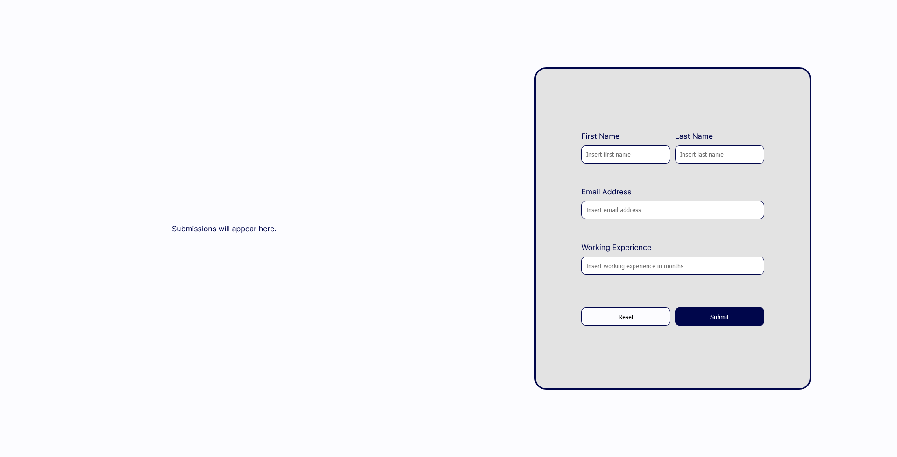
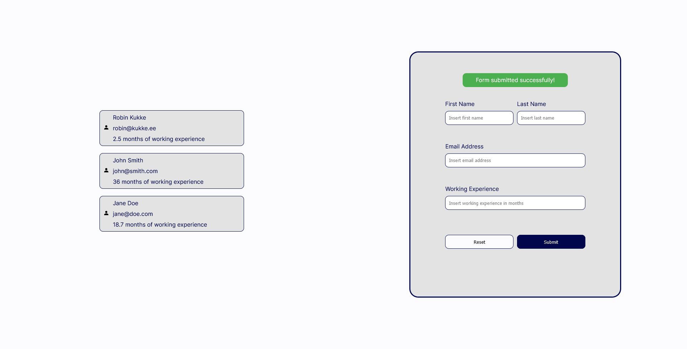
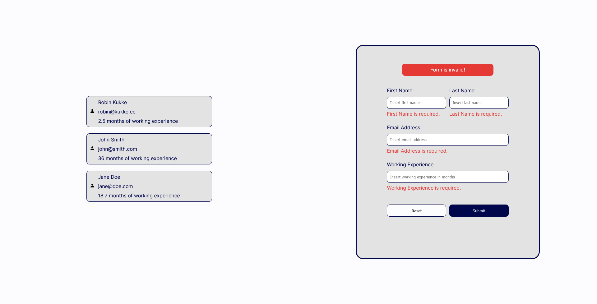

# Wisercat Form

Test assignment for Wisercat's junior front-end developer position. This project uses Angular 17.3.3.

## Prerequisites

* Node.js
* Angular CLI 17.3.3

## Running the development server

* `git clone https://github.com/robkukke/wisercat-form.git`
* `cd wisercat-form`
* `npm install`
* `ng serve`
* Navigate to `http://localhost:4200/`

## Screenshots

